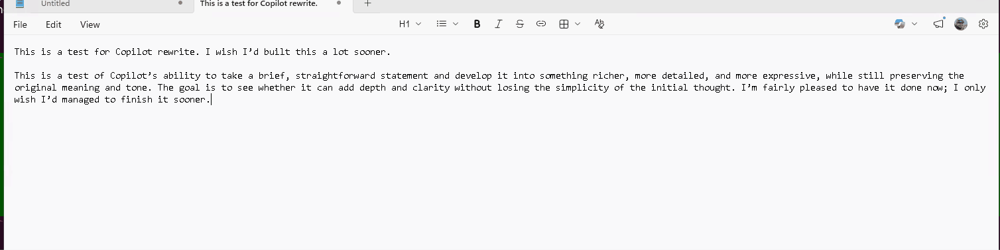

# RewriteTool

A lightweight Windows system tray app that rewrites selected text in any app using the GitHub Copilot SDK.



## How it works

1. Select text in any app
2. Press `Ctrl+Shift+R`
3. Pick a rewrite mode from the popup menu
4. Text is rewritten and pasted back in place
5. `Ctrl+Z` to undo

## Rewrite modes

- **Fix grammar** — fixes spelling, grammar, and punctuation
- **Make professional** — polished, business-ready tone
- **Make concise** — shorter, tighter wording
- **Expand** — adds detail and elaboration
- **Custom** — your own instruction

## Model selection

Right-click the tray icon to change the AI model. Available models are pulled from your Copilot subscription at runtime. Your selection is saved across restarts.

## Requirements

- Windows 10/11
- [GitHub Copilot](https://github.com/features/copilot) subscription
- GitHub CLI (`gh auth login`) for authentication

## Install

Download and run `RewriteToolSetup.exe` from [Releases](https://github.com/varunr89/rewrite-tool/releases), or build from source:

```bash
cd RewriteTool/RewriteTool
dotnet publish -c Release -o ./publish
```

## License

MIT
